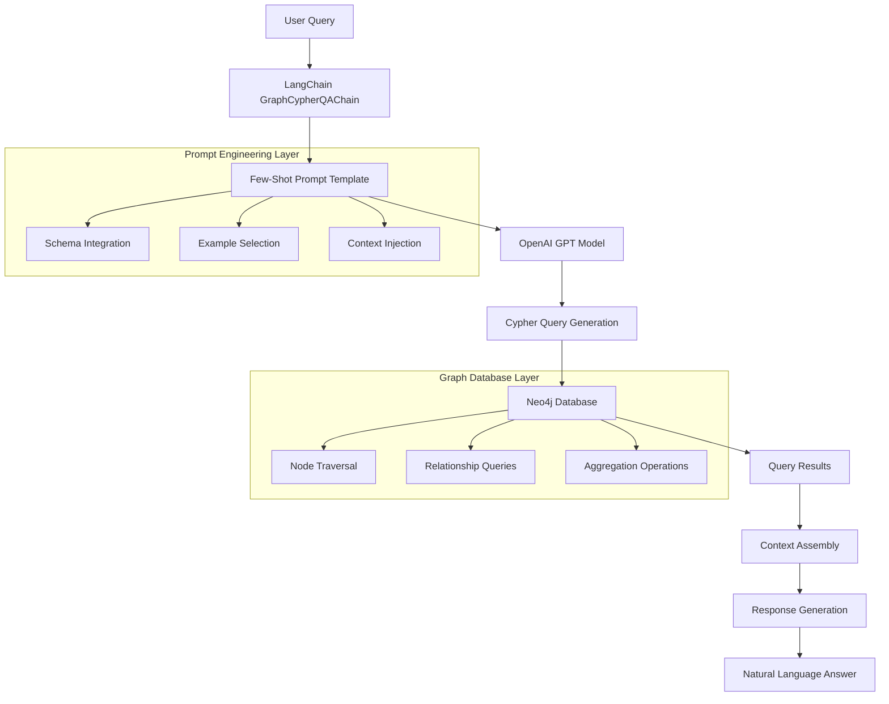
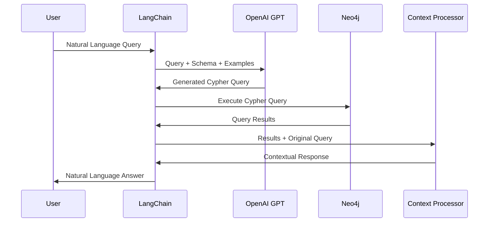
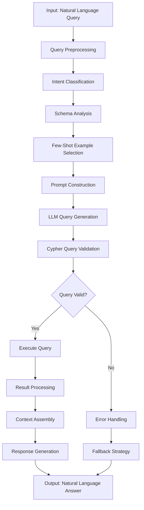
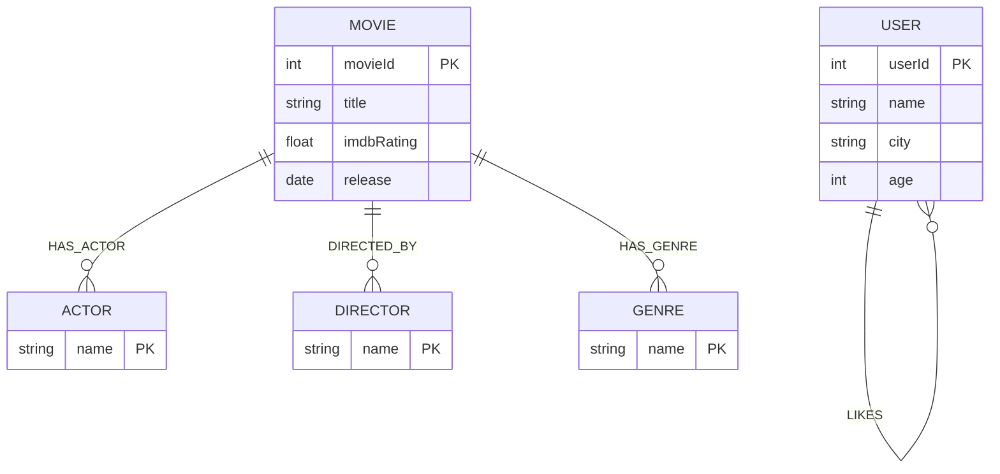

# Graph Database Question-Answering System with Advanced Prompt Engineering

## Abstract

This project implements a sophisticated Question-Answering (Q&A) system leveraging graph databases and Large Language Models (LLMs) to provide intelligent query processing over structured relational data. The system combines Neo4j graph database technology with OpenAI's GPT models through the LangChain framework to enable natural language querying of complex movie recommendation datasets.

## Table of Contents

- [Project Overview](#project-overview)
- [Architecture](#architecture)
- [Technology Stack](#technology-stack)
- [Core Concepts](#core-concepts)
- [System Architecture](#system-architecture)
- [Algorithm Workflow](#algorithm-workflow)
- [Installation & Setup](#installation--setup)
- [Usage](#usage)
- [Dataset](#dataset)
- [Performance Analysis](#performance-analysis)
- [Future Enhancements](#future-enhancements)
- [Contributing](#contributing)
- [License](#license)

## Project Overview

The Graph Database Q&A System represents a cutting-edge implementation of Retrieval-Augmented Generation (RAG) architecture specifically designed for graph-structured data. This system demonstrates advanced techniques in:

- **Graph-based Knowledge Representation**: Utilizing Neo4j for storing and querying complex relational data
- **Natural Language Processing**: Converting user queries into structured Cypher queries
- **Prompt Engineering**: Implementing few-shot learning strategies for improved query generation
- **Context-Aware Response Generation**: Leveraging structured data context for accurate answer formulation

### Key Features

- **Intelligent Query Translation**: Converts natural language questions into optimized Cypher queries
- **Few-Shot Learning Integration**: Implements advanced prompt strategies for improved model performance
- **Real-time Graph Traversal**: Efficient querying of complex relationship patterns
- **Contextual Response Generation**: Provides natural language answers based on graph query results
- **Extensible Architecture**: Modular design supporting various graph schemas and LLM providers

## Architecture

The system employs a multi-layered architecture that seamlessly integrates graph database operations with modern AI capabilities:

```
┌─────────────────┐    ┌──────────────────┐    ┌─────────────────┐
│   User Query    │───▶│  LangChain       │───▶│   Neo4j Graph   │
│ (Natural Lang)  │    │  Framework       │    │   Database      │
└─────────────────┘    └──────────────────┘    └─────────────────┘
                                │
                                ▼
                       ┌──────────────────┐
                       │   OpenAI GPT     │
                       │   Models         │
                       └──────────────────┘
```

## Technology Stack

### Core Technologies

| Component | Technology | Version | Purpose |
|-----------|------------|---------|---------|
| **Graph Database** | Neo4j | 5.14 | Primary data storage and querying engine |
| **LLM Framework** | LangChain | 0.2.x | Orchestration and prompt management |
| **Language Model** | OpenAI GPT-4o-mini | Latest | Natural language processing and generation |
| **Runtime Environment** | Python | 3.10+ | Primary development language |
| **Package Manager** | UV | Latest | Dependency management and virtual environments |

### Supporting Libraries

- **Data Processing**: Pandas, NumPy for data manipulation
- **Machine Learning**: Scikit-learn, PyTorch for advanced analytics
- **Web Framework**: Streamlit for potential UI development
- **Vector Operations**: FAISS, ChromaDB for similarity search
- **Natural Language**: NLTK, SpaCy for text processing

## Core Concepts

### 1. Graph Database Schema

The system implements a comprehensive movie recommendation schema with the following entities:

```cypher
// Node Types
Movie {movieId: INTEGER, title: STRING, imdbRating: FLOAT}
Director {name: STRING}
Actor {name: STRING}
Genre {name: STRING}

// Relationship Types
(:Movie)-[:DIRECTED_BY]->(:Director)
(:Movie)-[:HAS_ACTOR]->(:Actor)
(:Movie)-[:HAS_GENRE]->(:Genre)
```

### 2. Query Translation Pipeline

The system implements a sophisticated pipeline for converting natural language queries into executable Cypher statements:

1. **Query Analysis**: Semantic understanding of user intent
2. **Schema Mapping**: Identification of relevant nodes and relationships
3. **Query Generation**: Construction of optimized Cypher queries
4. **Execution**: Database query execution and result retrieval
5. **Response Synthesis**: Natural language answer generation

### 3. Few-Shot Learning Strategy

Advanced prompt engineering techniques are employed to enhance query generation accuracy:

- **Example-Based Learning**: Curated examples demonstrating proper query patterns
- **Context-Aware Prompting**: Dynamic prompt construction based on schema information
- **Error Handling**: Robust mechanisms for handling malformed or ambiguous queries

## System Architecture

### Component Interaction Flow



### Data Flow Architecture



## Algorithm Workflow

### Query Processing Pipeline



### Advanced Prompt Engineering Strategy

The system implements a sophisticated few-shot learning approach:

```python
# Example of Few-Shot Prompt Structure
examples = [
    {
        "question": "Which actors played in the movie Casino?",
        "cypher_query": "MATCH (m:Movie {title: 'Casino'})<-[:ACTOR_OF]-(a:Actor) RETURN a.name"
    },
    {
        "question": "How many movies has Tom Hanks acted in?",
        "cypher_query": "MATCH (a:Actor {name: 'Tom Hanks'})-[:ACTOR_OF]->(m:Movie) RETURN count(m)"
    }
]

prompt_template = """
You are a Neo4j expert. Given an input question, create a syntactically accurate Cypher query.

Schema: {schema}

Examples: {examples}

Question: {question}
Cypher Query: """
```

## Installation & Setup

### Prerequisites

- Python 3.10 or higher
- UV package manager
- Neo4j database instance (local or cloud)
- OpenAI API key

### Environment Configuration

1. **Clone the Repository**
```bash
git clone <repository-url>
cd 15.graph_database
```

2. **Install Dependencies**
```bash
uv sync
```

3. **Environment Variables**
Create a `.env` file with the following variables:
```env
# OpenAI Configuration
OPENAI_API_KEY=your_openai_api_key_here

# Neo4j Configuration
NEO4J_URI=bolt://localhost:7687
NEO4J_USERNAME=neo4j
NEO4J_PASSWORD=your_neo4j_password

# LangSmith Tracking (Optional)
LANGCHAIN_API_KEY=your_langsmith_api_key
LANGCHAIN_TRACING_V2=true
LANGCHAIN_PROJECT=graph-qa-system
```

### Database Setup

1. **Load Sample Data**
Execute the movie dataset loading script:
```python
# Run the data loading cell in 01.protopype.ipynb
movie_query = """
LOAD CSV WITH HEADERS FROM 'https://raw.githubusercontent.com/tomasonjo/blog-datasets/main/movies/movies_small.csv' AS row
// ... (complete query in notebook)
"""
```

## Usage

### Basic Query Execution

```python
from langchain_community.graphs import Neo4jGraph
from langchain_openai import ChatOpenAI
from langchain.chains import GraphCypherQAChain

# Initialize components
graph = Neo4jGraph(
    url=os.environ["NEO4J_URI"],
    username=os.environ["NEO4J_USERNAME"],
    password=os.environ["NEO4J_PASSWORD"],
)

llm = ChatOpenAI(model="gpt-4o-mini", temperature=0)

# Create the QA chain
chain = GraphCypherQAChain.from_llm(
    llm=llm,
    graph=graph,
    verbose=True,
    allow_dangerous_requests=True,
    return_intermediate_steps=True,
    use_function_response=True,
    top_k=5,
)

# Execute queries
response = chain.invoke({"query": "What are the best-rated movies?"})
print(response['result'])
```

### Advanced Few-Shot Prompting

```python
# Implement custom few-shot prompt template
from langchain_core.prompts import FewShotPromptTemplate, PromptTemplate

examples = [
    {
        "question": "Which actors played in the movie Casino?",
        "cypher_query": "MATCH (m:Movie {title: 'Casino'})<-[:ACTOR_OF]-(a:Actor) RETURN a.name"
    }
]

example_prompt = PromptTemplate.from_template(
    "Question: {question}\nCypher Query: {cypher_query}"
)

prompt = FewShotPromptTemplate(
    examples=examples,
    example_prompt=example_prompt,
    prefix="You are a Neo4j expert. Create accurate Cypher queries.",
    suffix="Question: {question}\nCypher Query: ",
    input_variables=["question", "schema"]
)
```

## Dataset

The system utilizes a comprehensive movie recommendation dataset featuring:

- **Movies**: 1,000+ movie records with titles, ratings, and metadata
- **Actors**: Extensive actor database with relationship mappings
- **Directors**: Director information with filmography connections
- **Genres**: Genre classifications with movie associations
- **User Data**: User profiles and interaction patterns (social network)

### Data Schema



## Future Enhancements

### Planned Features

1. **Multi-Modal Support**: Integration of image and video metadata
2. **Real-Time Streaming**: Live data updates and streaming query processing
3. **Advanced Analytics**: Machine learning-based recommendation algorithms
4. **API Development**: RESTful API for external system integration
5. **Visualization Tools**: Interactive graph visualization capabilities
6. **Query Performance Metrics**: Average Response Time and Accuracy Rate
7. **Optimization Strategies**: Query Caching, Index Optimization, Batch Processing, Connection Pooling

### Research Directions

- **Federated Learning**: Distributed query processing across multiple graph databases
- **Semantic Query Optimization**: AI-driven query plan optimization
- **Natural Language Generation**: Enhanced response quality through advanced NLG techniques
- **Privacy-Preserving Queries**: Implementation of differential privacy in graph queries

## Contributing

We welcome contributions from the research and development community. Please refer to our contribution guidelines:

1. Fork the repository
2. Create a feature branch (`git checkout -b feature/amazing-feature`)
3. Commit your changes (`git commit -m 'Add amazing feature'`)
4. Push to the branch (`git push origin feature/amazing-feature`)
5. Open a Pull Request

### Development Guidelines

- Follow PEP 8 style guidelines
- Include comprehensive test coverage
- Update documentation for new features
- Ensure backward compatibility

## License

This project is licensed under the MIT License - see the [LICENSE](LICENSE) file for details.

## Acknowledgments

- **Dataset Provider**: Special thanks to [Tomaz Bratanic](https://github.com/tomasonjo) for providing the movie recommendation dataset
- **Neo4j Community**: For excellent documentation and community support
- **LangChain Team**: For the comprehensive framework enabling seamless LLM integration
- **OpenAI**: For providing state-of-the-art language models

## Contact

For questions, suggestions, or collaboration opportunities, please contact:

- **Project Lead**: Vinicius Rondon
- **Email**: vinicius.rondon.102155@ga.ita.br
- **LinkedIn**: www.linkedin.com/in/vinicius-rondon-8a4639272
- **GitHub**: https://github.com/viniciusrondon

---

*This project represents a significant contribution to the field of graph-based question-answering systems and serves as a foundation for future research in knowledge graph reasoning and natural language processing.*
